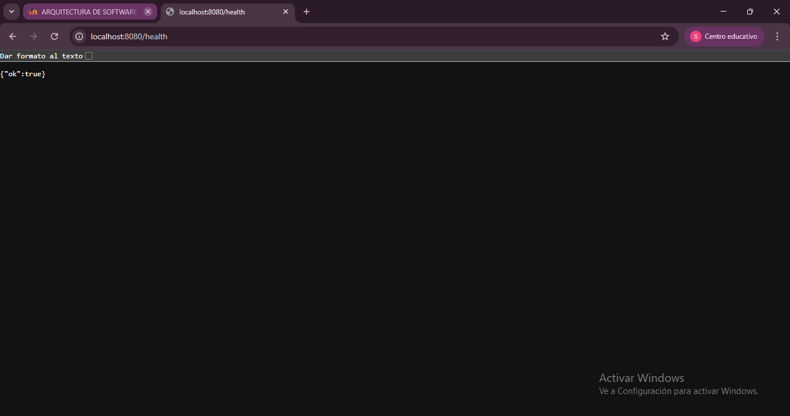
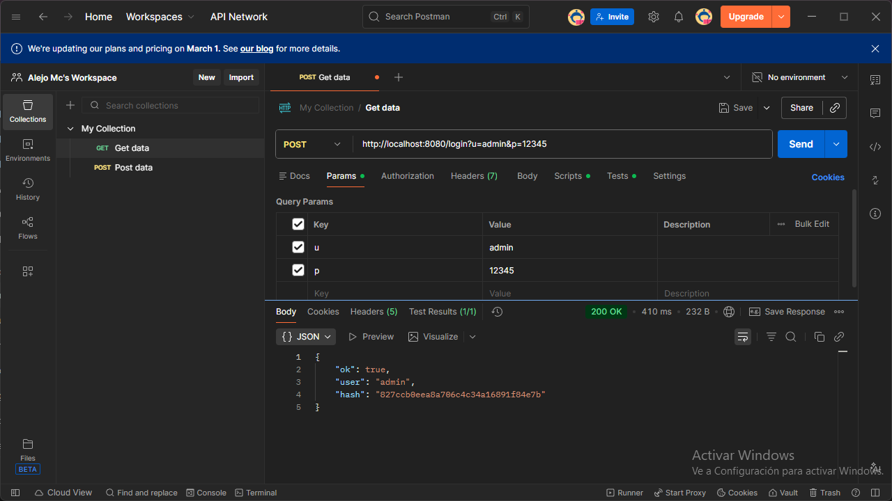
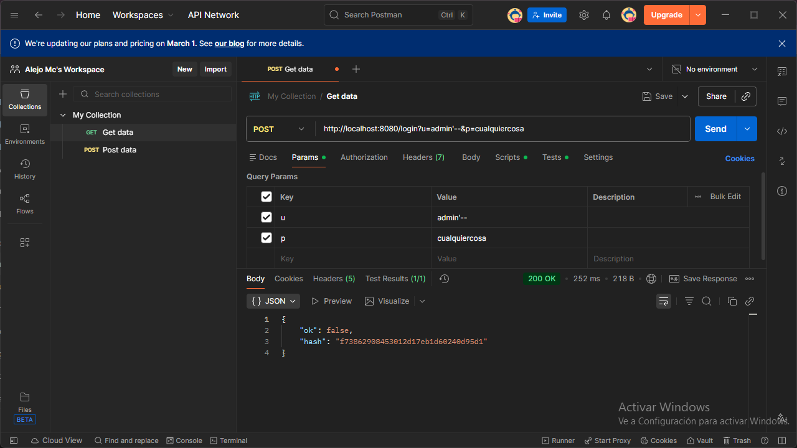
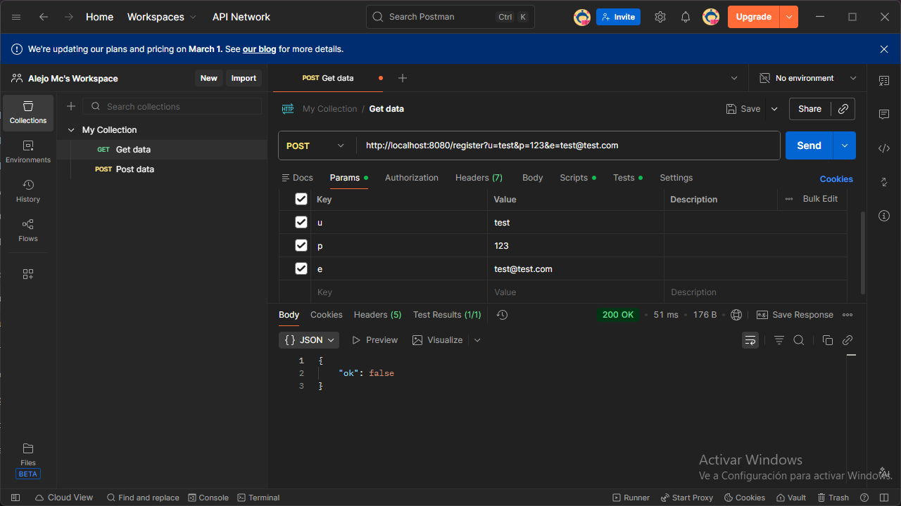
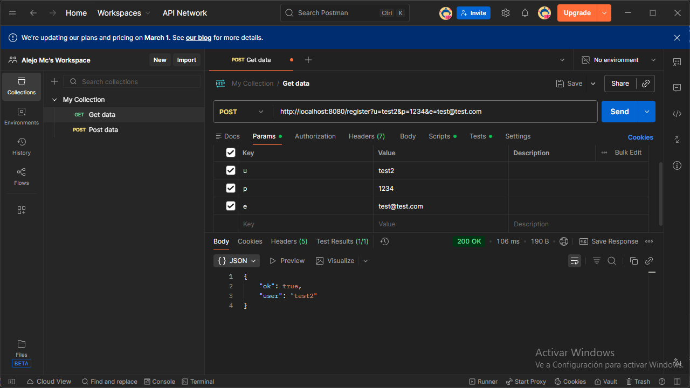

# FASE 1 - Levantamiento del ambiente

Levantamiento exitoso

---

# FASE 2 - Auditoría del Código

A partir de los distintos archivos del código se presentan los hallazgos de problemas encontrados teniendo en cuenta principios de Clean Code, SOLID y Seguridad Básica.

## Tabla de Hallazgos — Auditoría Clean Code y Seguridad

| # | Descripción del problema | Archivo | Línea aprox. | Principio violado | Riesgo |
|---|--------------------------|---------|--------------|------------------|--------|
| 1 | Construcción de consulta SQL mediante concatenación directa del parámetro `u` (posible SQL Injection) | UserRepository.java | ~17-18 | Seguridad básica (SQL Injection) | Alto |
| 2 | Inserción SQL con concatenación directa de datos del usuario en el método `save` | UserRepository.java | ~29-30 | Seguridad básica (SQL Injection) | Alto |
| 3 | Credenciales de base de datos hardcodeadas en el repositorio | UserRepository.java | ~12-14 | Seguridad / Clean Code | Alto |
| 4 | Uso de MD5 para hashing de contraseñas (algoritmo inseguro y obsoleto) | AuthService.java | ~57-65 | Seguridad básica (hashing débil) | Alto |
| 5 | Exposición del hash de la contraseña en la respuesta del login | AuthService.java | ~27 y ~32 | Principio de mínima exposición de datos | Alto |
| 6 | Validación de contraseña extremadamente débil (solo longitud > 3) | AuthService.java | ~41 | Seguridad básica | Alto |
| 7 | Atributos públicos en la entidad User, incluyendo `password` (violación de encapsulamiento) | User.java | ~3-7 | Clean Code / Encapsulamiento | Medio |

---

# FASE 3 — Pruebas Funcionales

Se realizaron pruebas manuales utilizando Postman contra la API levantada en localhost:8080.

---

## 🧪 Prueba 1 — Login válido

**Petición:**

    POST http://localhost:8080/login?u=admin&p=12345

**Respuesta:**

    Status: 200 OK

    {
      "ok": true,
      "user": "admin",
      "hash": "827ccb0eea8a706c4c34a16891f84e7b"
    }

### 🔎 Análisis

- La autenticación fue exitosa con credenciales correctas.
- El sistema retorna el campo `"hash"` correspondiente al MD5 de la contraseña en la respuesta HTTP.
- Exponer el hash no es necesario para el cliente y representa un riesgo, ya que podría ser utilizado en ataques de tipo fuerza bruta o rainbow tables.
- El uso de MD5 no es recomendable actualmente porque es un algoritmo criptográficamente vulnerable.

### ⚠ Problema detectado

El hash de la contraseña no debería enviarse en la respuesta. Aunque esté cifrado, sigue siendo información sensible que puede facilitar ataques de fuerza bruta, permitir ataques de rainbow tables y exponer lógica interna del sistema.

### ✅ Conclusión

La autenticación funciona, pero existe una vulnerabilidad de exposición de información sensible.

**Riesgo: Alto**

---

## 🧪 Prueba 2 — SQL Injection

**Petición:**

    POST http://localhost:8080/login?u=admin'--&p=cualquiercosa

**Respuesta:**

    Status: 200 OK

    {
      "ok": false,
      "hash": "f73862908453012d17eb1d60240d95d1"
    }

### 🔎 Análisis

- El sistema respondió con `"ok": false`, por lo que en este caso la autenticación no fue exitosa.
- Sin embargo, al analizar el código fuente de `UserRepository`, se observa que la consulta SQL se construye así:

        String q = "select username, email, password from users where username = '" + u + "'";

- Los parámetros no están siendo sanitizados ni se están utilizando `PreparedStatement`.
- Aunque en esta prueba no se logró evadir la autenticación, la vulnerabilidad estructural sigue existiendo y en producción podría permitir bypass de autenticación, manipulación de consultas y exposición o modificación de datos.

### ⚠ Problema detectado

La construcción de consultas mediante concatenación de strings es una vulnerabilidad crítica.

### ✅ Conclusión

Existe una vulnerabilidad de SQL Injection aunque no se haya explotado exitosamente en esta prueba.

**Riesgo: Alto**

---

## 🧪 Prueba 3 — Registro con contraseña débil

### Primer intento — contraseña rechazada

**Petición:**

    POST /register?u=test&p=123&e=test@test.com

**Respuesta:**

    Status: 200 OK

    {
      "ok": false
    }

### 🔎 Análisis

La contraseña `"123"` fue rechazada porque en `AuthService` la validación es `p.length() > 3`. Como `"123"` tiene longitud 3, no cumple la condición y el registro es rechazado.

---

### Segundo intento — contraseña aceptada

**Petición:**

    POST /register?u=test&p=1234&e=test@test.com

**Respuesta:**

    Status: 200 OK

    {
      "ok": true,
      "user": "test"
    }

### 🔎 Análisis

El sistema permitió el registro porque `"1234"` cumple la condición `> 3`. La única validación implementada es la longitud mínima de 4 caracteres. No se validan complejidad, longitud mínima adecuada, caracteres especiales ni mayúsculas/minúsculas.

### ⚠ Problema detectado

La validación es extremadamente débil. Una contraseña de 4 caracteres es insegura y vulnerable a ataques de fuerza bruta.

### ✅ Conclusión

El sistema permite contraseñas inseguras, lo que representa un riesgo de seguridad medio.

**Riesgo: Medio**
